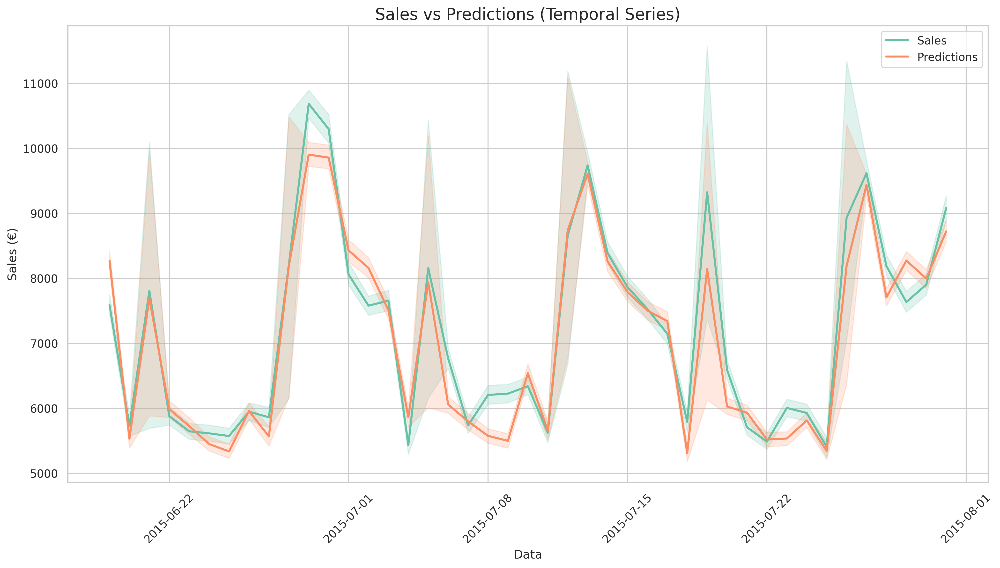
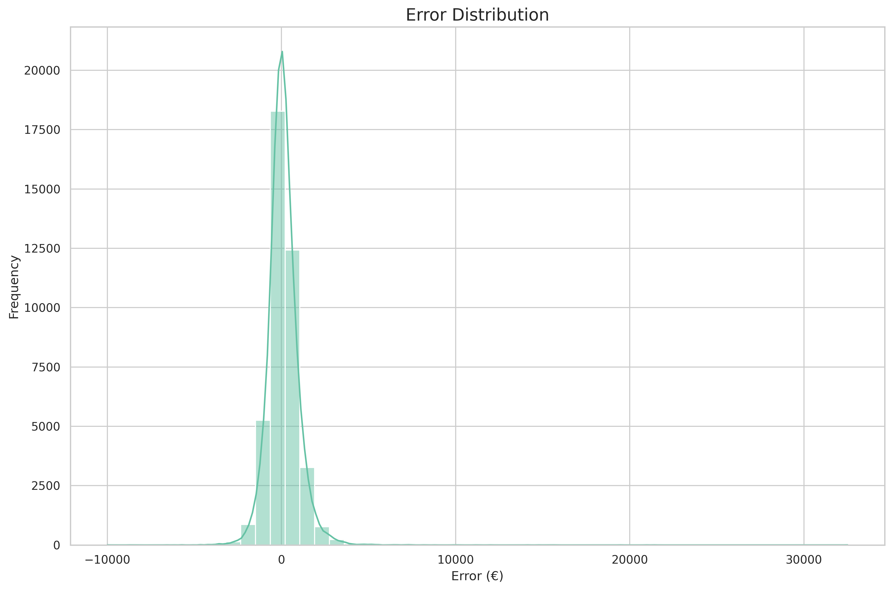
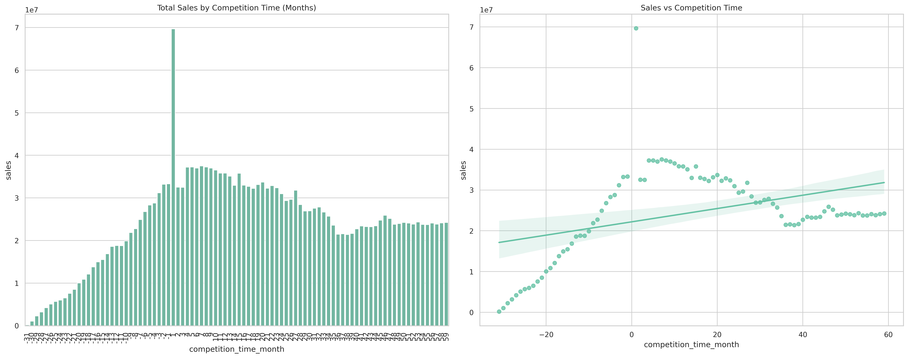
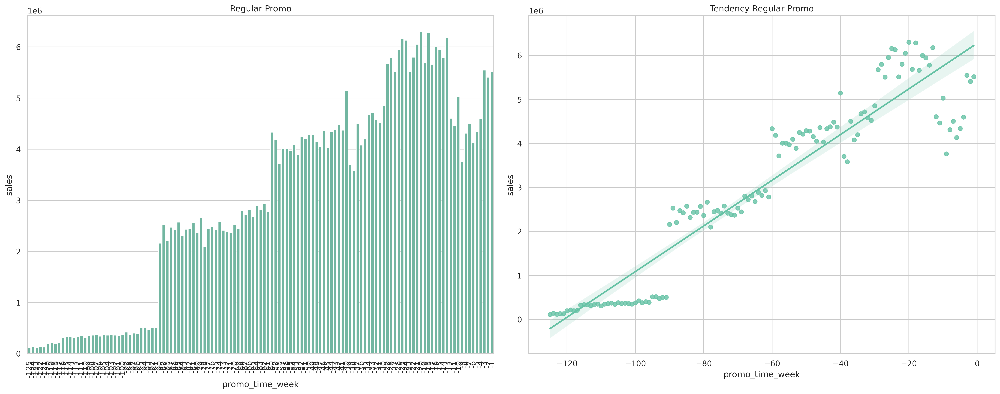
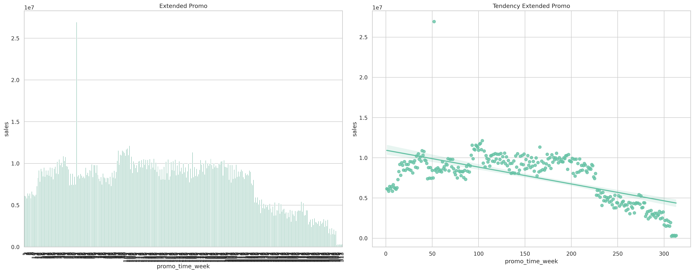
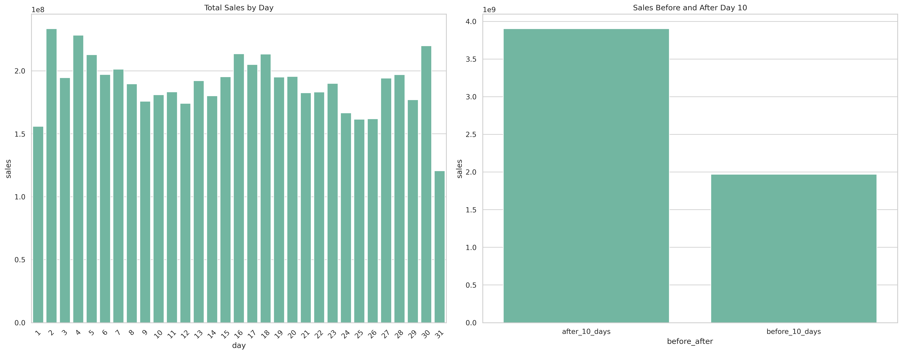
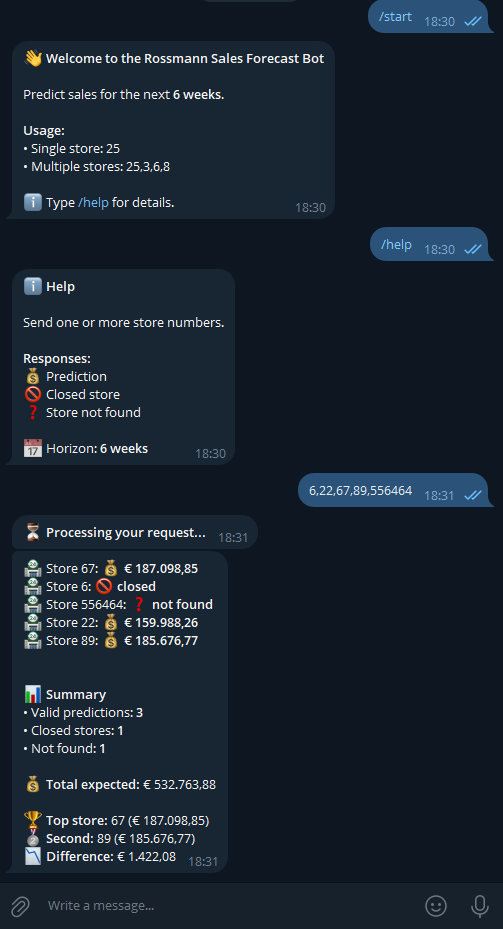

<h1>📈 Rossmann Sales Forecast — Projeto End-to-End de Ciência de Dados</h1>

<strong>Previsão de vendas para 1.115 lojas da Rossmann (horizonte de 6 semanas)</strong>, 
desenvolvida a partir de um pipeline completo de Ciência de Dados baseado no 
<strong>CRISP-DM</strong>, com foco em <em>valor de negócio</em>, <em>tomada de decisão executiva</em> 
e <em>deploy em produção</em>.

<h2>🎯 Problema de Negócio</h2>

O CFO da Rossmann decidiu iniciar reformas estruturais em parte das lojas da rede. 
Para viabilizar esse planejamento financeiro, foi solicitado aos gerentes que estimassem 
o faturamento das próximas <strong>6 semanas</strong>, permitindo provisionar corretamente 
o capital necessário para cada reforma.

O problema é que, até então, essas previsões eram feitas de forma <strong>manual e descentralizada</strong>, 
onde cada gerente utilizava critérios próprios, sem padronização e sem considerar de forma 
estruturada fatores como promoções, concorrência, sazonalidade e feriados.

Diante desse cenário, este projeto tem como objetivo <strong>automatizar e padronizar</strong> 
as previsões de faturamento, entregando os resultados de forma simples e acessível 
via <strong>aplicativo Telegram</strong>, permitindo:

<ul>
  <li>Consulta rápida por loja</li>
  <li>Comparação entre múltiplas lojas</li>
  <li>Identificação da loja com maior faturamento previsto</li>
  <li>Visualização da diferença de faturamento entre as melhores lojas</li>
</ul>

<h2>📌 Premissas do Negócio</h2>
<ul>
  <li>As previsões estão disponíveis <strong>24/7</strong> via Telegram, bastando informar o código da loja.</li>
  <li>Apenas lojas com histórico de vendas maior que zero foram consideradas para previsão.</li>
  <li>Dias em que as lojas estavam fechadas foram removidos da modelagem.</li>
  <li>Caso o usuário consulte uma loja fechada ou inexistente, o sistema retorna uma mensagem informativa.</li>
</ul>

<h2>🧩 Metodologia — CRISP-DM</h2>
<ol>
  <li>Entendimento do Problema de Negócio</li>
  <li>Coleta e Descrição dos Dados</li>
  <li>Limpeza e Tratamento de Dados</li>
  <li>Análise Exploratória de Dados (EDA)</li>
  <li>Preparação dos Dados</li>
  <li>Engenharia e Seleção de Features (Boruta + ExtraTrees)</li>
  <li>Modelagem (Baseline → XGBoost)</li>
  <li>Cross-Validation Temporal</li>
  <li>Fine-Tuning com Optuna</li>
  <li>Avaliação e Tradução para Negócio</li>
  <li>Deploy em Produção</li>
</ol>

<h2>📊 Avaliação do Modelo</h2>

O modelo foi avaliado utilizando <strong>validação temporal</strong>, simulando o comportamento real 
de previsões futuras. A métrica principal utilizada foi o <strong>RMSE</strong>, interpretado também 
sob a ótica de impacto financeiro.

<!-- Gráfico Real vs Predito -->
<strong>Vendas Reais vs Previsões</strong>

Este gráfico demonstra a capacidade do modelo em acompanhar o comportamento real das vendas 
ao longo do tempo, evidenciando boa aderência às variações sazonais.

<!-- Gráfico Distribuição do Erro -->
<strong>Distribuição do Erro</strong>

A distribuição do erro mostra uma concentração próxima de zero, indicando estabilidade do modelo 
e menor risco de erros extremos, o que é fundamental para decisões financeiras.

<h2>📈 Evolução do Modelo</h2>

<table border="1" cellpadding="6">
  <tr>
    <th>Versão</th>
    <th>Features</th>
    <th>Tuning</th>
    <th>RMSE</th>
    <th>Observação</th>
  </tr>
  <tr>
    <td>v1</td>
    <td>Boruta + RandomForest</td>
    <td>Random Search</td>
    <td>1120</td>
    <td>Baseline inicial</td>
  </tr>
  <tr>
    <td>v2</td>
    <td>Boruta + ExtraTrees</td>
    <td>Optuna</td>
    <td>895</td>
    <td>Melhor performance offline</td>
  </tr>
  <tr>
    <td>v3</td>
    <td>Reutilização das features</td>
    <td>Optuna</td>
    <td>912</td>
    <td>Versão final compatível com Render (512MB)</td>
  </tr>
</table>

Apesar de uma leve perda de performance em relação à v2, a versão final foi escolhida 
por garantir <strong>estabilidade, menor consumo de memória e viabilidade de deploy</strong> 
em ambiente real de produção.

<h2>💡 Principais Insights de Negócio</h2>

<strong>Competição e Distância</strong>

Foi identificado que lojas com competidores mais próximos apresentam, em média, 
<strong>maior volume de vendas</strong>, contrariando o senso comum. Esse comportamento sugere 
que regiões com maior competitividade tendem a concentrar maior fluxo de consumo.

Por outro lado, ao longo do tempo, a presença contínua de competidores tende a reduzir 
gradualmente as vendas, indicando possível saturação do mercado local.

<strong>Promoções Regulares vs Estendidas</strong>

Promoções iniciadas após períodos sem descontos apresentam crescimento significativo de vendas, 
mostrando-se eficazes para alavancagem de faturamento.

Entretanto, promoções consecutivas (promoções estendidas) demonstraram queda de performance, 
indicando possível desgaste do estímulo ao consumidor.

Esse insight abre espaço para decisões estratégicas sobre <strong>frequência e duração de campanhas promocionais</strong>.

<strong>Sazonalidade Mensal</strong>

Observou-se que o maior volume de vendas ocorre após o dia 10 de cada mês, possivelmente associado 
a ciclos de pagamento da população. Esse padrão pode orientar decisões de estoque e campanhas direcionadas.

<h2>🚀 Produto de Dados em Produção</h2>
<ul>
  <li>API Flask para previsões de vendas</li>
  <li>Bot Telegram para interação em tempo real</li>
  <li>Deploy no Render (plano gratuito)</li>
</ul>

<strong>Repositórios relacionados:</strong>

<ul>
  <li><a href="https://github.com/polloncarlos/rossmann_api">Rossmann API</a></li>
  <li><a href="https://github.com/polloncarlos/rossmann_telegram_bot">Rossmann Telegram Bot</a></li>
</ul>

<h3>🤖 Interface de Consumo — Bot Telegram</h3>

Para garantir que as previsões fossem realmente utilizadas na prática, 
foi desenvolvido um <strong>bot no Telegram</strong> como camada de interface 
entre o modelo e os decisores do negócio.

Essa abordagem elimina a necessidade de dashboards complexos ou acesso técnico, 
permitindo que executivos e gestores consultem previsões de forma 
<strong>rápida, intuitiva e em tempo real</strong>.

<ul>
  <li>Consulta individual por código da loja</li>
  <li>Consulta de múltiplas lojas em uma única mensagem</li>
  <li>Ranking automático por faturamento previsto</li>
  <li>Identificação da loja com maior e segunda maior previsão</li>
  <li>Cálculo da diferença de faturamento entre as lojas líderes</li>
</ul>

A resposta do bot retorna valores formatados, feedback de processamento 
e mensagens claras em casos de erro ou indisponibilidade do serviço, 
reforçando a experiência do usuário.

<!-- Imagem do funcionamento do bot -->

  

Essa solução aproxima o modelo do contexto real de tomada de decisão, 
transformando previsões estatísticas em <strong>informação acionável</strong>.

<h2>🛠️ Stack Tecnológica</h2>
<ul>
  <li>Python 3.10</li>
  <li>Pandas, NumPy, Scikit-learn</li>
  <li>XGBoost</li>
  <li>Optuna</li>
  <li>Flask</li>
  <li>Render</li>
</ul>

<h2>📌 Conclusão</h2>

Este projeto representa a construção de uma solução completa de Ciência de Dados,
indo da compreensão do problema de negócio até a entrega de um produto funcional em produção.
Ao longo do processo, foram aplicadas boas práticas de análise, modelagem e deploy,
sempre com foco em gerar valor real para o negócio.

O trabalho demonstra capacidade de estruturar problemas, tomar decisões técnicas conscientes
(dados, modelo e infraestrutura) e transformar análises em informações acionáveis,
mesmo sob restrições comuns a ambientes reais de produção.

